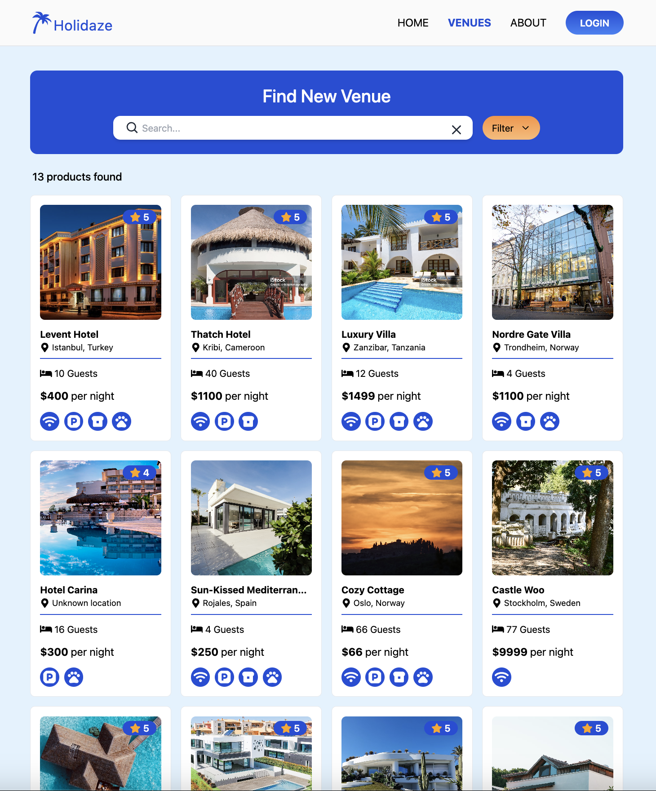

# Project Exam 2, Holidaze



## Deployment

 https://project-exam-2-karolina-szymanska.netlify.app

## Description

A newly launched accommodation booking site called Holidaze has approached you to develop a brand new front end for their application. While they have a list of required features, the design and user experience has not been specified. Working with the official API documentation, plan, design and build a modern front end accommodation booking application.

There are two aspects to this brief: the customer-facing side of the website where users can book holidays at a venue, and an admin-facing side of the website where users can register and manage venues and bookings at those venues.

The client has specified the following requirements in the form of User Stories:

- A user may view a list of Venues
- A user may search for a specific Venue
- A user may view a specific Venue page by id
- A user may view a calendar with available dates for a Venue
- A user with a stud.noroff.no email may register as a customer
- A registered customer may create a booking at a Venue
- A registered customer may view their upcoming bookings
- A user with a stud.noroff.no email may register as a Venue manager
- A registered Venue manager may create a Venue
- A registered Venue manager may update a Venue they manage
- A registered Venue manager may delete a Venue they manage
- A registered Venue manager may view bookings for a Venue they manage
- A registered user may login
- A registered user may update their avatar
- A registered user may logout

## Built With

- [Vite](https://vitejs.dev/)
- [React](https://react.dev/)
- [React-Router-DOM](https://reactrouter.com/en/main)
- [TailwindCSS](https://tailwindcss.com/)

<div>
  &nbsp;
  &nbsp;
  &nbsp;
  &nbsp;
</div>

## API

API Documentation: https://docs.noroff.dev/docs/v2
API Swagger: https://v2.api.noroff.dev/docs/static/index.html

## Getting Started

### Installing

1. Clone the repo:

```
https://github.com/karolina-szymanska/project-exam-2
```

2. Install the dependencies:

```
npm install
```

### Running

To run the app, run the following commands:

For building Vite project

```
npm run build
```

For development mode

```
npm run dev
```

View in Browser
Open the provided localhost link in your preferred web browser

### Contact

[](https://www.linkedin.com/in/karolina-szyma%C5%84ska-64b36089/)

[](https://github.com/karolina-szymanska)

[](mailto:karolinaszymanska899@gmail.com)
